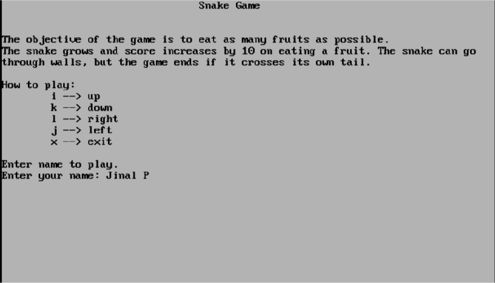
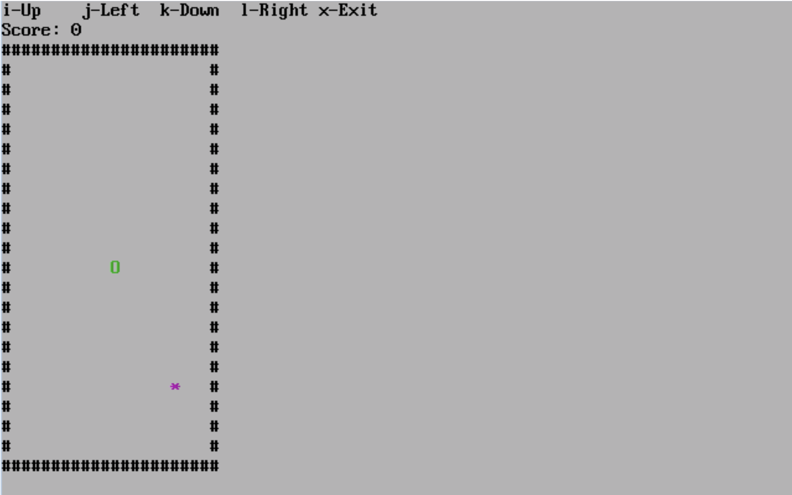
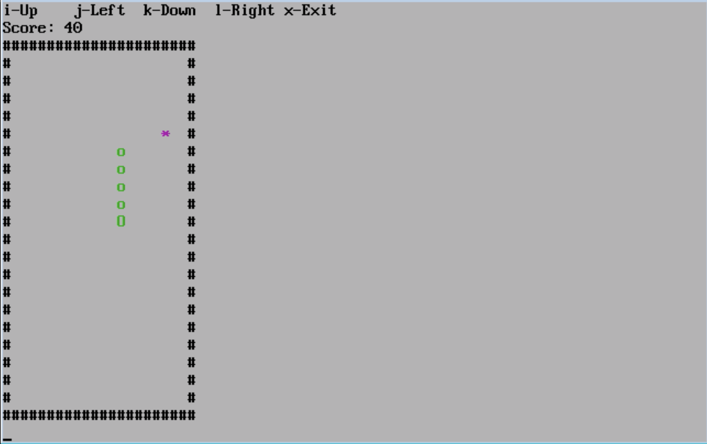
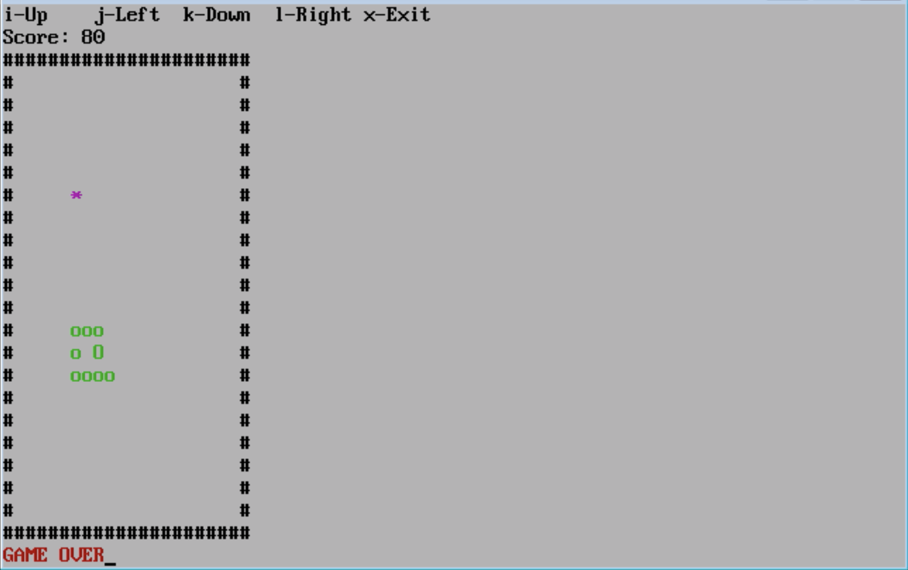
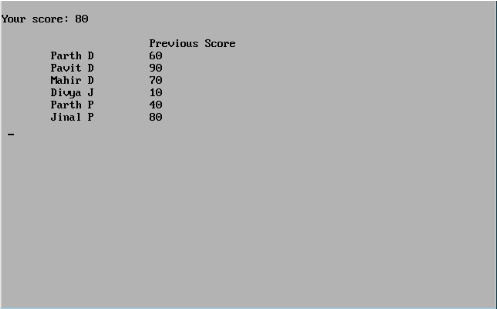

# Snake Game in C++ :snake:

The snake is moved with the help of 'i', 'j', 'k' and 'l' keys.
- i -> up
- j -> left
- k -> down
- l -> right

To end or exit the game 'x' key is used.

The objective is to eat as many fruits and score as many points as possible, without killing the snake.

For each fruit eaten by the snake 10 points are scored.

The game ends if the snake gets killed by crossing over itself. The snake can go through a wall and emerge from the opposite wall.

After the game ends, the player’s score is displayed along with previous scores of previous users.

1. Welcome screen

2. Game starts

3. Playing the game

4. Game over

5. Score board

